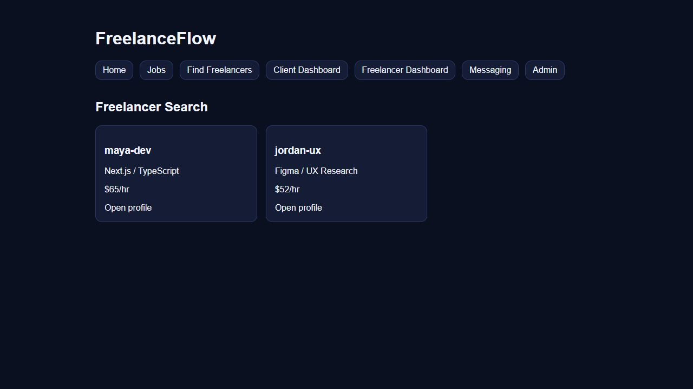

# Freelancer search separator: local runtime evidence

This evidence demonstrates the scoped frontend change in PR #1634 / issue #1632: skill lists render with the ASCII ` / ` separator.

[Watch the sampled runtime capture (MP4)](freelancer-search-runtime.mp4)

## Source and observed behavior

- Application source commit: `153336e0db93fcab6a15caf0bad9d7ac46da7064` (`Fix freelancer search skill separator`). This evidence-only addition does not change that application source.
- The checkout was clean when the server started. The production build had passed compilation and type checking on September 30; its build ID and generated route hash were verified unchanged before this capture.
- Build ID: `ynTY5hza9ci471l5G7uVA`.
- Generated `freelancers/search.html` SHA-256: `0634e992e48078e002dcb2b58188f26695ffd537a1d9a17856bbe847fecf5be7`.
- Runtime: Node 22.22.2, Next.js 16.2.6, React 19.2.0. The existing production build was served at `http://127.0.0.1:3134` with `next start --hostname 127.0.0.1 --port 3134`.
- At `2026-10-02T20:42:23.9945784Z`, a fresh request to `/freelancers/search` returned HTTP 200 with both `Next.js / TypeScript` and `Figma / UX Research` in the served HTML.
- The browser capture then showed the running search route, navigation to Home, and navigation back through Find Freelancers. Both skill strings render with slash separation in the initial and final search views.

## Capture provenance

The screenshot is an unmodified browser viewport capture of the running local application. The video was encoded from 24 sequential, unmodified viewport JPEG captures, with their recorded sampling intervals. It is a sampled browser sequence, not continuous screen recording. No image generation, simulated interface, overlaid annotations, cropping, or added interface content was used. The prior annotated GIF is not the source of these artifacts.

- First frame: `2026-10-02T20:47:43.713Z`.
- Last captured frame: `2026-10-02T20:47:51.400Z`.
- Home was clicked before frame 6; Find Freelancers was clicked before frame 12.
- Each of the 24 encoded presentation timestamps matches the corresponding captured interval with a 1 ms time base. The last frame is repeated after a 250 ms hold to finalize the stream.
- Output: H.264 High / yuv420p, 1280 by 720, 25 frames, 7.938 seconds, 64,658 bytes, no audio. Encoding is lossy; the MP4 is not pixel-identical to the source JPEGs.
- Encoding used FFmpeg 8.1.1, concat input with per-image `framerate 1000`, CRF 18, B-frames disabled, variable frame timing, `enc_time_base=1:1000`, and `video_track_timescale=1000`. JPEG full-range color was explicitly converted to video range.
- FFprobe verified dimensions, codec, duration, frame count, and all presentation timestamps. Strict H.264 decoding succeeded. Source search/Home/search frames and a decoded Home video frame were visually inspected.

SHA-256 checksums:

| Artifact | SHA-256 |
| --- | --- |
| `freelancer-search.jpg` | `b5a791510df0243d7095e8fbb99364cef21fed03709e113d054a72a43f63a3fc` |
| `freelancer-search-runtime.mp4` | `ae15e6a9df84b651fbea1107f274ae9639c854580d519df64e310c67735af7ce` |
| Retained raw capture manifest | `f121abc112bfacac8a7d699088dc610ba233ea2d1d8b60f7777b08fac1d807e1` |
| Source frames 0 and 23 | `b5a791510df0243d7095e8fbb99364cef21fed03709e113d054a72a43f63a3fc` |
| Source frame 8 (Home) | `4332d0c5d683be72b4438ae4ca9823b182c97ebc55b025fee541bbfd4d93bc75` |

The local raw frames and timing manifest are retained separately; this small proof bundle includes the final screenshot and MP4. The owned local server was stopped after capture.

## Scope and limits

The cards are repository-defined synthetic fixtures from `apps/web/lib/mock.ts`. This proves frontend rendering/navigation for the scoped separator fix. It does not demonstrate backend integration, real user data, production deployment, payment processing, maintainer acceptance, or bounty eligibility/payment. No real credentials or payment details were used.

The unrelated API test runner failure described in the PR remains outside this one-file frontend fix; this evidence does not relabel it as a passing API test.
